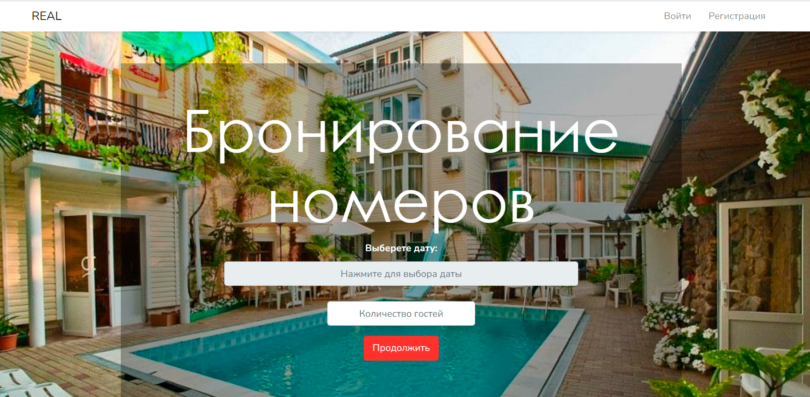

__Бронирование номеров__

Приложение по бронированию, учёта и управлению объектов недвижимости: 
Квартир, апартаментов, номеров гостиниц, отелей, гостевых домов. 

[ДЕМО](https://real.v-php.ru// "REAL")

(Laravel & Vue.js)

Сайт разработан для управляющей компании сдающей объекты посуточно внаём.

Прототип моего "боевого" сайта по сдаче апартаментов - коммерческой недвижимости.  [Здесь](https://mieten.ru/ "Мой боевой сайт")

Интегрирован функцианал Hotel Datepicker на JavaScript, компонент Vue.

Разработана админ панель по гибкой настройке условий бронирования, визуальной насторйке главной страницы, правил календаря.

Для массовой загрузки фото добавлена легковесная библиотека javascript - Dropzone.js. Используется Ajax.

Визуализация фото - Slider Bootstrap.

Функцианал разработан с учётом личного использования и тестирования приложения.

[ДЕМО](https://real.v-php.ru// "REAL")